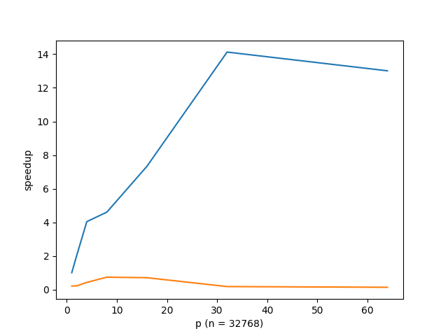

# Programming Assignments 3.5 & 3.6

## 实验目的

实现矩阵与向量相乘的程序，其中矩阵为 `n x n` 。

## 实验步骤

### 3.5 以列为单位分块计算

### 计算思路

首先，将矩阵分割为 p 个 子矩阵，每个矩阵为 `n x local_n` ，其中 `local_n = n / p` 。同样地，将向量分割为 p 个子向量，每个向量都有 `local_n` 个元素。将子矩阵和子向量相乘：

```cpp
MPI_Scatter(flat_matrix, 1, block_col_mpi_t, local_matrix, n * local_n,
            MPI_DOUBLE, 0, comm);
MPI_Scatter(vector, local_n, MPI_DOUBLE, local_vector, local_n, MPI_DOUBLE, 0,
            comm);
double time_after_scatter = MPI_Wtime();
MPI_Barrier(comm);
double time_before_calc = MPI_Wtime();

for (int i = 0; i < n; i++) {
  local_sum[i] = 0.0;
  for (int j = 0; j < local_n; j++) {
    local_sum[i] += local_matrix[i * local_n + j] * local_vector[j];
  }
}
```


此时，`local_sum` 为 `n x 1` 的向量，它保存了结果向量的部分和。我们需要对其进行求和。为了让剩下的求和的任务也分散到各个进程，采用了 `MPI_Reduce_scatter` 函数，最后再 `MPI_Gather` 回来：

```cpp
MPI_Reduce_scatter(local_sum, local_ans, recv_counts, MPI_DOUBLE, MPI_SUM,
                   comm);
MPI_Gather(local_ans, local_n, MPI_DOUBLE, answer, local_n, MPI_DOUBLE, 0,
           comm);
```

### 计时方法

采用的是 `MPI_Wtime` 函数。为了保证计时取各个进程最长的，采用了 `MPI_Barrier` 。

```cpp
double time_before_scatter = MPI_Wtime();
MPI_Scatter(flat_matrix, 1, block_col_mpi_t, local_matrix, n * local_n,
MPI_DOUBLE, 0, comm);
MPI_Scatter(vector, local_n, MPI_DOUBLE, local_vector, local_n, MPI_DOUBLE, 0,
comm);
double time_after_scatter = MPI_Wtime();
MPI_Barrier(comm);
double time_before_calc = MPI_Wtime();
// calc...
MPI_Barrier(comm);
double time_after_calc = MPI_Wtime();
```

### 测速结果

在集群上运行 `srun -n $N prog3.5 $P` 得到的时间（scatter+calc）：

| p\n  | 512               | 2048              | 8192              | 16384             | 32768             |
| ---- | ----------------- | ----------------- | ----------------- | ----------------- | ----------------- |
| 串   | 0.000166          | 0.002786          | 0.036893          | 0.280732          | 0.715940          |
| 1    | 0.001476/0.000240 | 0.011547/0.002478 | 0.159910/0.041286 | 0.641507/0.174470 | 2.564583/0.705935 |
| 2    | 0.001899/0.000148 | 0.018986/0.002028 | 0.190350/0.020539 | 0.701266/0.085107 | 2.754509/0.349013 |
| 4    | 0.001613/0.000145 | 0.010514/0.000806 | 0.103788/0.009865 | 0.386315/0.041858 | 1.472941/0.176863 |
| 8    | 0.001911/0.000159 | 0.008007/0.000921 | 0.102332/0.008524 | 0.259549/0.033296 | 0.803871/0.155272 |
| 16   | 0.002041/0.000141 | 0.009946/0.000401 | 0.098155/0.007355 | 0.391268/0.024654 | 0.904196/0.097594 |
| 32   | 0.002674/0.000499 | 0.019681/0.000507 | 0.271671/0.004532 | 1.006703/0.014355 | 3.762699/0.050689 |
| 64   | 0.005673/0.000421 | 0.027237/0.000858 | 0.344984/0.003288 | 1.238004/0.008784 | 4.861116/0.029271 |

可以看到，时间基本都花在生成数据和通信上，而实际计算时间并不长。对于同样的数据大小，计算时间与并行度大体上呈负相关的趋势，在数据量大的时候较为明显，数据量小的时候并不显著。在并行度较大的时候，一台机器不足以提供足够的并行度，需要不同机器之间互相通信，这部分的开销并不小。



上面这附图是 `n=32768` 的情况。横坐标表示 `p` ，纵坐标表示加速比，蓝色表示仅计算时间，橙色表示数据分发时间与计算时间求和。可以看到，加速比随 p 在一定范围内基本是正比，但加速比会到达一个上限。由于数据量比较大，并且 p 大时涉及到集群内不同机器之间的通信，导致加速比反而在下降。这个问题在数据量更大的时候应该会有所改善，但是在实践过程中发现，如果将 n 提高到 65536，会导致 MPI_Scatterv 出错，因而无法继续测试。


上面这附图是 `p=64` 的情况。横坐标表示 `n` ，纵坐标表示加速比，蓝色表示仅计算时间，橙色表示数据分发时间与计算时间求和。这个时候，由于数据分发时间都远大于计算时间，所以橙色的值都很小。而蓝色表示的加速比，在数据量大的时候，并行度提高对加速比的影响比较显著，并且也出现了和之前类似的瓶颈的情况。