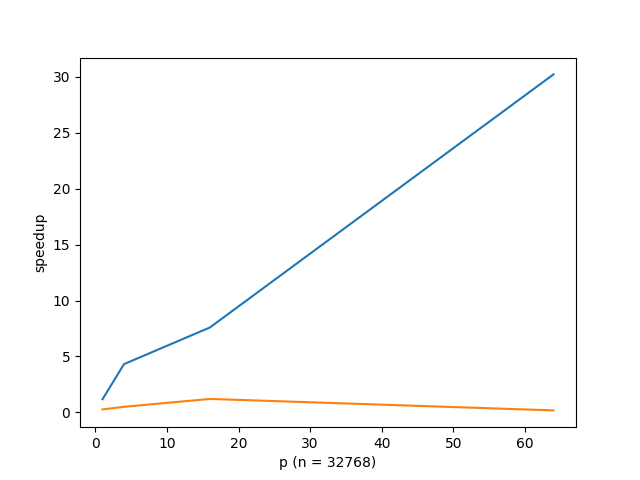

# Programming Assignments 3.5 & 3.6

## 实验目的

实现矩阵与向量相乘的程序，其中矩阵为 `n x n` 。

## 实验步骤

### 3.5 以列为单位分块计算

#### 计算思路

首先，将矩阵分割为 p 个 子矩阵，每个矩阵为 `n x local_n` ，其中 `local_n = n / p` 。同样地，将向量分割为 p 个子向量，每个向量都有 `local_n` 个元素。将子矩阵和子向量相乘：

```cpp
MPI_Scatter(flat_matrix, 1, block_col_mpi_t, local_matrix, n * local_n,
            MPI_DOUBLE, 0, comm);
MPI_Scatter(vector, local_n, MPI_DOUBLE, local_vector, local_n, MPI_DOUBLE, 0,
            comm);
double time_after_scatter = MPI_Wtime();
MPI_Barrier(comm);
double time_before_calc = MPI_Wtime();

for (int i = 0; i < n; i++) {
  local_sum[i] = 0.0;
  for (int j = 0; j < local_n; j++) {
    local_sum[i] += local_matrix[i * local_n + j] * local_vector[j];
  }
}
```


此时，`local_sum` 为 `n x 1` 的向量，它保存了结果向量的部分和。我们需要对其进行求和。为了让剩下的求和的任务也分散到各个进程，采用了 `MPI_Reduce_scatter` 函数，最后再 `MPI_Gather` 回来：

```cpp
MPI_Reduce_scatter(local_sum, local_ans, recv_counts, MPI_DOUBLE, MPI_SUM,
                   comm);
MPI_Gather(local_ans, local_n, MPI_DOUBLE, answer, local_n, MPI_DOUBLE, 0,
           comm);
```

#### 计时方法

采用的是 `MPI_Wtime` 函数。为了保证计时取各个进程最长的，采用了 `MPI_Barrier` 。

```cpp
double time_before_scatter = MPI_Wtime();
MPI_Scatter(flat_matrix, 1, block_col_mpi_t, local_matrix, n * local_n,
MPI_DOUBLE, 0, comm);
MPI_Scatter(vector, local_n, MPI_DOUBLE, local_vector, local_n, MPI_DOUBLE, 0,
comm);
double time_after_scatter = MPI_Wtime();
MPI_Barrier(comm);
double time_before_calc = MPI_Wtime();
// calc...
MPI_Barrier(comm);
double time_after_calc = MPI_Wtime();
```

#### 测速结果

在集群上运行 `srun -n $N prog3.5 $P` 得到的时间（scatter/calc）：

| p\n  | 512               | 2048              | 8192              | 16384             | 32768             |
| ---- | ----------------- | ----------------- | ----------------- | ----------------- | ----------------- |
| 串   | 0.000166          | 0.002786          | 0.036893          | 0.280732          | 0.715940          |
| 1    | 0.001476/0.000240 | 0.011547/0.002478 | 0.159910/0.041286 | 0.641507/0.174470 | 2.564583/0.705935 |
| 2    | 0.001899/0.000148 | 0.018986/0.002028 | 0.190350/0.020539 | 0.701266/0.085107 | 2.754509/0.349013 |
| 4    | 0.001613/0.000145 | 0.010514/0.000806 | 0.103788/0.009865 | 0.386315/0.041858 | 1.472941/0.176863 |
| 8    | 0.001911/0.000159 | 0.008007/0.000921 | 0.102332/0.008524 | 0.259549/0.033296 | 0.803871/0.155272 |
| 16   | 0.002041/0.000141 | 0.009946/0.000401 | 0.098155/0.007355 | 0.391268/0.024654 | 0.904196/0.097594 |
| 32   | 0.002674/0.000499 | 0.019681/0.000507 | 0.271671/0.004532 | 1.006703/0.014355 | 3.762699/0.050689 |
| 64   | 0.005673/0.000421 | 0.027237/0.000858 | 0.344984/0.003288 | 1.238004/0.008784 | 4.861116/0.029271 |

可以看到，时间基本都花在生成数据和通信上，而实际计算时间并不长。对于同样的数据大小，计算时间与并行度大体上呈负相关的趋势，在数据量大的时候较为明显，数据量小的时候并不显著。在并行度较大的时候，一台机器不足以提供足够的并行度，需要不同机器之间互相通信，这部分的开销并不小。


上图是 `n=32768` 的情况。横坐标表示 `p` ，纵坐标表示加速比，蓝色表示仅计算时间，橙色表示数据分发时间与计算时间求和。可以看到，加速比随 p 在一定范围内基本是正比，但加速比会到达一个上限。由于数据量比较大，并且 p 大时涉及到集群内不同机器之间的通信，导致加速比反而在下降。这个问题在数据量更大的时候应该会有所改善，但是在实践过程中发现，如果将 n 提高到 65536，会导致 MPI_Scatterv 出错，因而无法继续测试。


上图是 `p=64` 的情况。横坐标表示 `n` ，纵坐标表示加速比，蓝色表示仅计算时间，橙色表示数据分发时间与计算时间求和。这个时候，由于数据分发时间都远大于计算时间，所以橙色的值都很小。而蓝色表示的加速比，在数据量大的时候，并行度提高对加速比的影响比较显著，并且也出现了和之前类似的瓶颈的情况。

### 3.6 以子矩阵为单位分块计算

#### 计算思路

此时，将矩阵分割为 `comm_sz` 个 `local_n x local_n` 个子矩阵，相应地把向量也分割为 `local_n x 1` 的向量。 首先，把每个子矩阵分发到 comm_sz 个进程中，为了实现这个，对 `MPI_Type_XXX` 进行了相应的修改。

```cpp
/* n blocks each containing local_n elements */
/* The start of each block is n doubles beyond the preceding block */
MPI_Type_vector(local_n, local_n, n, MPI_DOUBLE, &vect_mpi_t);

/* Resize the new type so that it has the extent of local_n doubles */
MPI_Type_create_resized(vect_mpi_t, 0, local_n * sizeof(double),
                        &block_sub_mpi_t);
MPI_Type_commit(&block_sub_mpi_t);
// omitted ...
int *sendcounts = new int[comm_sz];
int *displs = new int[comm_sz];
for (int i = 0;i < sqrt_comm_sz;i++) {
  for (int j = 0;j < sqrt_comm_sz;j++) {
    sendcounts[i * sqrt_comm_sz + j] = 1;
    displs[i * sqrt_comm_sz + j] = i * sqrt_comm_sz * local_n + j;
  }
}
MPI_Scatterv(flat_matrix, sendcounts, displs, block_sub_mpi_t, local_matrix, local_n * local_n,
             MPI_DOUBLE, 0, comm);
for (int i = 0;i < sqrt_comm_sz;i++) {
  for (int j = 0;j < sqrt_comm_sz;j++) {
    sendcounts[i * sqrt_comm_sz + j] = local_n;
    displs[i * sqrt_comm_sz + j] = j * local_n;
  }
}
MPI_Scatterv(vector, sendcounts, displs, MPI_DOUBLE, local_vector, local_n, MPI_DOUBLE, 0,
             comm);
```


接着，把第一行子矩阵计算的结构求和，放到这行第一个子矩阵对应的进程中，为此创建了一个新的 Comm ：

```cpp
// every row a comm
MPI_Comm row_comm;
int my_row_rank;
MPI_Comm_split(MPI_COMM_WORLD, my_rank / sqrt_comm_sz, my_rank, &row_comm);
// omitted ...
for (int i = 0; i < local_n; i++) {
  local_sum[i] = 0.0;
  for (int j = 0; j < local_n; j++) {
    local_sum[i] += local_matrix[i * local_n + j] * local_vector[j];
  }
}

MPI_Reduce(local_sum, local_ans, local_n, MPI_DOUBLE, MPI_SUM, 0,
           row_comm);
```

最后，再把这些求和 `MPI_Gather` 到主进程中，也为此创建了一个新的 Comm：

```cpp
// first col a comm
MPI_Group world_group;
MPI_Comm_group(MPI_COMM_WORLD, &world_group);

int *ranks = new int[sqrt_comm_sz];
for (int i = 0;i < sqrt_comm_sz;i++) {
  ranks[i] = i * sqrt_comm_sz;
}

MPI_Group col_group;
MPI_Group_incl(world_group, sqrt_comm_sz, ranks, &col_group);

// Create a new communicator based on the group
MPI_Comm col_comm;
MPI_Comm_create_group(MPI_COMM_WORLD, col_group, 0, &col_comm);

MPI_Gather(local_ans, local_n, MPI_DOUBLE, answer, local_n, MPI_DOUBLE, 0,
           col_comm);
```

整体上是一个 `comm_sz -> sqrt(comm_sz) -> 1` 个进程的数据流动过程。

#### 计时方法

和 3.5 相同，不再赘述

#### 测速结果


在集群上运行 `srun -n $N prog3.6 $P` 得到的时间（scatter/calc）：

| p\n  | 512               | 2048              | 8192              | 16384             | 32768             |
| ---- | ----------------- | ----------------- | ----------------- | ----------------- | ----------------- |
| 串   | 0.000134          | 0.002837          | 0.041194          | 0.282623          | 0.828762          |
| 1    | 0.001946/0.000314 | 0.012118/0.002702 | 0.164508/0.042110 | 0.640259/0.173419 | 2.551954/0.707172 |
| 4    | 0.001514/0.000086 | 0.008916/0.000848 | 0.091164/0.011547 | 0.374912/0.046355 | 1.489790/0.192226 |
| 16   | 0.001990/0.000098 | 0.009211/0.000312 | 0.076894/0.006982 | 0.148467/0.027129 | 0.583201/0.109212 |
| 64   | 0.005826/0.000209 | 0.016571/0.000278 | 0.330780/0.002585 | 1.206173/0.010320 | 4.831784/0.027418 |

数据与 3.5 中得到的差不多。只不过由于 p 需要是完全平方数，数据量比较少。



上图是 `n=32768` 的情况。横坐标表示 `p` ，纵坐标表示加速比，蓝色表示仅计算时间，橙色表示数据分发时间与计算时间求和。与 3.5 的结论是一致的。


上图是 `p=64` 的情况。横坐标表示 `p` ，纵坐标表示加速比，蓝色表示仅计算时间，橙色表示数据分发时间与计算时间求和。与 3.5 的结论是一致的。

## 实验结论

通过不同方法对矩阵进行分割，设计了不同的计算过程，最后得到和串行计算相同的结果。可以看到，对于不是特别大的数据量，数据传输的时间占比例可能会很大，即使把计算并行化了，仍然没有原来跑得快。所以，优化需要针对特定情况，不要过早优化，否则会得不偿失。